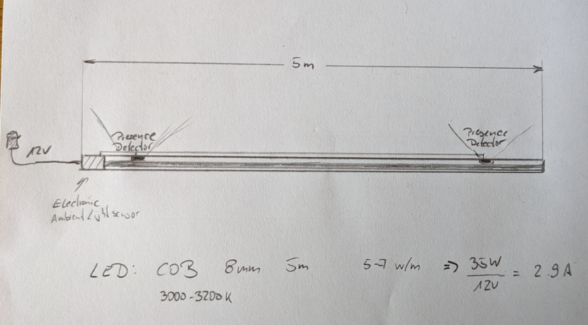

# Sensor Light

A smart light bar — illuminates dark places on-demand by gently powering-up/down a LED stripe depending on the ambient light level and a detected human presence.

Hardware core is a ESP32-H2 SoC connected with an VEML7700 ambient light sensor and a small but effective LD2410 radar based presence sensor.
This automatic floor light is completely self-contained.

_It does not use Wifi or Zigbee features of the ESP32-H2 SoC and does not connect to a smart home system with that firmware here - but one may add such a feature smoothly, of course._

Status:
- Software: ready, tested; release-candidate
- Hardware: beta; release-candidate

## Sketch

_TODO replace with final photo_

## Hardware

### Wiring diagram

The wiring diagram includes a separate flash adapter (on the left side), which is can be connected to the main unit via a 4-pin connector. It's required to flash the ESP32-H2 once it's soldered.
The programming board connects to a computer or any other suitable programming environment via a standard USB-C connector. 
Please note:
  - This programming board is not strictly required in a scenario, when one has its own way of initial flashing the SoC before soldering and don't wish to update the firmware later
  - While flashing / monitoring the chip via the flash adapter, we still need power supply through the 12V socket

### [Parts]((./hardware/parts.md))

### References

- [Switching with transistors](https://dl6gl.de/schalten-mit-transistoren.html)

## Software

Complete program code is included here. In order to build it and flash the ESP32-H2 one needs a ESP32 Rust embedded toolchain.

We are going to use an ESP32-H2 SoC with Rust embedded Toolchain with `[std]`.
For that and this project we need:

- Rust compiler (see www.rust-lang.org) 
- Rust embedded toolchain for ESP32-H2 for projects using __std__ lib
    Follow the instructions for `[std]` projects in this book chapter:
    [The Rust on ESP Book - Setting Up a Development Environment](https://esp-rs.github.io/book/installation/index.html)
    Notes on this:
      - ignore sections for `[no_std]` 
      - When it comes to the step `espup install`, you should consider using `espup install --targets esp32h2` instead, to avoid installing lots of unnecessary dependencies for unused Espressif targets. 
- `cargo build`

To flash the ESP:
- `cargo run`

## Terms & Conditions
Feel free to use anything here for learning, building your own version or make a product out of it and even sell it.
In case you find it useful, the author would be delighted to notice a small donation in [Solana](https://solana.com/) to his wallet: `FTMfeKYhpVAouuwXjpJXhnT13fkeNJqQsRGMBxBo1GML`.

Pull requests are welcome.

_bitmagier, July 2024_
