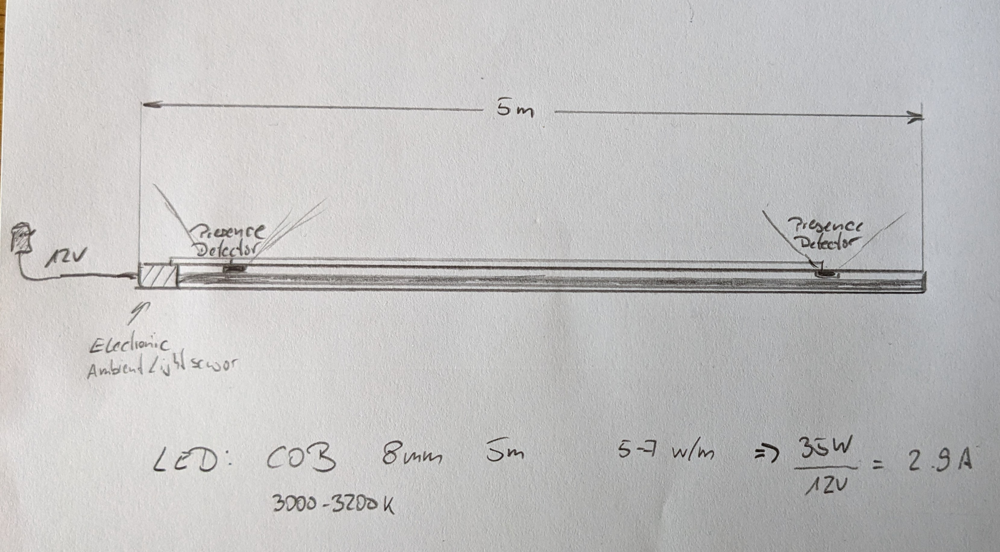

# Floor Light

LED light bar — illuminates dark places on-demand by gently dimming the LEDs up and down depending on the ambient light level and detected human presence.

The floor light is completely self-contained. We are not going to use Wifi or Zigbee features of the SoC.
It just needs 12V DC.

## Sketch

## Hardware

[Notes on used components](./hardware/hardware-notes.md)

The wiring diagram includes a separate programming board (on the left side), which can be connected to the main unit via a 5-pin connector.
The programming board connects to a computer or any other suitable programming environment via a standard USB-C connector.

## Software

Complete program code is included here. In order to build it and flash the ESP32-H2 one needs a ESP32 Rust embedded toolchain.
A short setup manual can be found [here](./software_setup.md).  

## Terms

Feel free to use anything here for learning, to build your own LED light bar version or make a product out of it and sell it.
In case you find it useful, I would be delighted to see a donation in Solana to `FTMfeKYhpVAouuwXjpJXhnT13fkeNJqQsRGMBxBo1GML`.
