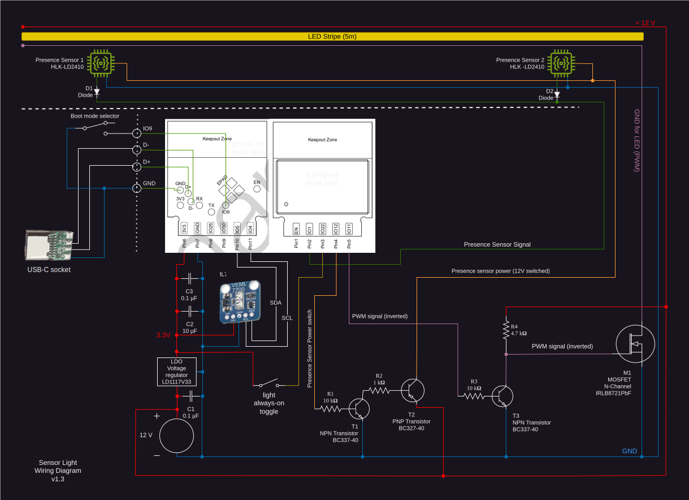

# Sensor Light

_A smart light bar — illuminates dark places on-demand by gently dimming up/down a LED stripe depending on the ambient light level and a detected human presence._

This automatic light is completely self-contained – just needs a suitable 12 V power supply.

An advanced (and quite inexpensive) presence sensor is used here, which works to my satisfaction. However, it should be fine-tuned using the manufacturer app at the final location to get the best out of it.

The circuit and software is designed to save power where possible.  
An ESP32-H2 SoC low power processor serves for the logic. It is connected to a VEML7700 ambient light sensor and the mentioned small but effective LD2410 radar-based presence sensor.

It does NOT use any radio features (Wi-Fi / Zigbee / Matter) of the ESP32-H2 SoC. One may feel free to add that or some sort of Smart Home connector on his own.

__Status: Hardware and software is feature-complete, tested and ready to Roll 'n' Roll.__

## Hardware
### Wiring diagram
<a>
    <source media="(prefers-color-scheme: dark)" srcset="hardware/wiring_diagram_dark.svg">
    <source media="(prefers-color-scheme: light)" srcset="hardware/wiring_diagram_light.svg">
    
</a>

The wiring diagram includes a separate flash adapter (on the left side), which is can be connected to the main unit via a 4-pin connector. It's required to flash the ESP32-H2 once it's soldered.
The programming board connects to a computer or any other suitable programming environment via a standard USB-C connector.
Please note:
- This programming board is not strictly required in a scenario, when one has its own way of initially flashing the SoC before soldering and does not wish to update the firmware later
- While flashing / monitoring the chip via the flash adapter, we still need power supply through the 12 V socket

### Prototype pictures
<a>
    <table style="border-style: none">
        <tr>
            <th></th>
            <th></th>
        </tr>
    </table>
</a>

### Parts 

#### LED bar 

_Designed for 12 V and (up to) 35 W LED Stripe._

- ESP32-H2-WROOM-03 _(the 2MB flash model is sufficient)_
- VEML7700 Ambient Light Sensor
- HLK-LD2410 Radar presence sensor (2x)
- BC337-40 TO92 NPN Transistor (2x)
- BC327-40 TO92 PNP Transistor
- IRLB8721PbF N-Channel MOSFET (TO-220)
- Resistor 1 kΩ
- Resistor 10 kΩ (2x)
- Resistor 4.7 kΩ
- Capacitor 0.1 µF (2x)
- Capacitor 10 µF
- 3.3V LDO voltage regulator LD1117V33 (SOT-223)
- Micro slide switch
- Diode (any, working at 3.3 V and 150 mA max.)
- 5 m LED Stripe (12 V, Color 3000-3200k, COB, 8 mm wide, Power: 5–7 W/m)
- 12 V DC Connector
- 12 V 5 A Power Supply _(look for a good one to avoid flickering and lower power consumption)_
- Wiring Board
- 4 Pin Connector Mini Socket
- Cables
- LED Housing (5 m)

#### USB Flash Adapter
- USB-C Plug Female
- 4 Pin Connector Plug + Cable
- On/Off Switch

## Software

Complete program code is included under `/code` 

We are going to use an ESP32-H2 SoC with Rust embedded Toolchain with the `[std]` lib.
Here is an overview of what's needed to build and run the software:

- Rust compiler (see www.rust-lang.org) 
- Rust embedded toolchain for ESP32-H2 for projects using `[std]` lib
    - Follow the instructions for `[std]` projects in this book chapter:
        [The Rust on ESP Book – Setting Up a Development Environment](https://esp-rs.github.io/book/installation/index.html)
    - Notes:
      - ignore sections for `[no_std]` 
      - When it comes to the step `espup install`, you may consider using `espup install --targets esp32h2` instead, to avoid installing lots of unnecessary dependencies for unused Espressif targets.
- `cargo build`
 
After connecting the ESP32-H2 via a flash adapter to a USB computer port: 
- `cargo run --release`  _(flashes the chip)_
- `espflash monitor` _(optional – see ESP32 console output)_ 

## Terms & Conditions
Pull requests are welcome.

Feel free to use anything here for learning, build your own version or make a product out of it and sell it.  
Have fun!

_In case you find this work useful and like to support the author, a gratitude donation to SOL Account: [`FTMfeKYhpVAouuwXjpJXhnT13fkeNJqQsRGMBxBo1GML`](./hardware/pictures/solana_wallet.png)_ would be appreciated.

---
_bitmagier_
