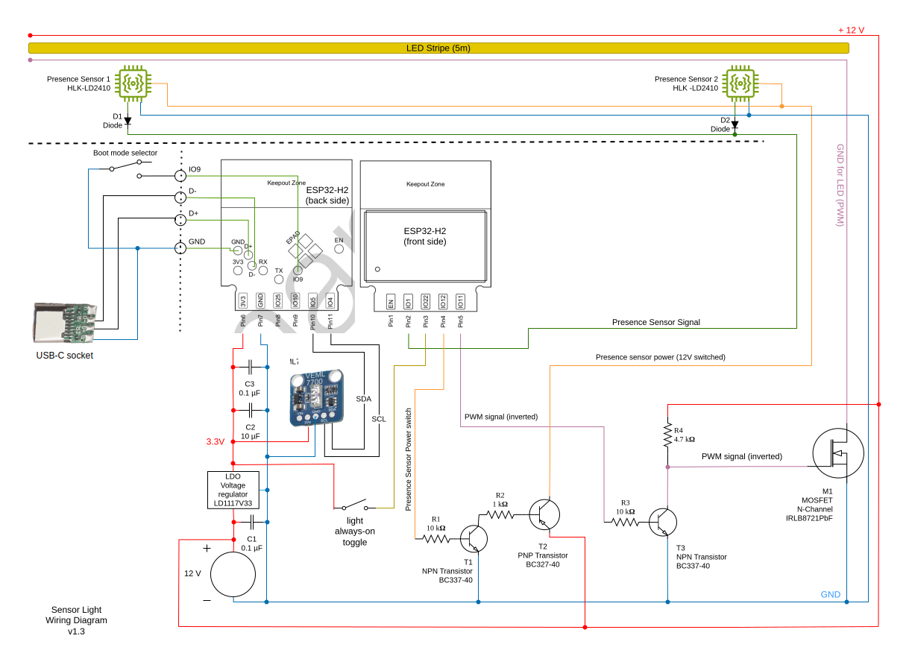

# Sensor Light

A smart light bar — illuminates dark places on-demand by gently dimming up/down a LED stripe depending on the ambient light level and a detected human presence.

This automatic light is completely self-contained – just needs 12V power supply.

An advanced but quite cheap presence sensor is used here, which works to my satisfaction. The circuit and software is designed to save power where possible. 
An ESP32-H2 SoC low power processor serves for the logic. It is connected to a VEML7700 ambient light sensor and the mentioned small but effective LD2410 radar based presence sensor.

It does NOT need nor use any Wifi / Zigbee / Matter features of the ESP32-H2 SoC. One may feel free to add a Smart Home connector on his own.

_Status: Hardware and Software is feature complete, tested and ready to Roll 'n' Roll._

## Hardware

<a>
    <table style="border-style: none">
        <tr>
            <th></th>
            <th></th>
        </tr>
    </table>
</a>

### Wiring diagram
<a>
    <source media="(prefers-color-scheme: dark)" srcset="hardware/wiring_diagram_dark.svg">
    <source media="(prefers-color-scheme: light)" srcset="hardware/wiring_diagram_light.svg">
    
</a>

The wiring diagram includes a separate flash adapter (on the left side), which is can be connected to the main unit via a 4-pin connector. It's required to flash the ESP32-H2 once it's soldered.
The programming board connects to a computer or any other suitable programming environment via a standard USB-C connector.
Please note:
- This programming board is not strictly required in a scenario, when one has its own way of initial flashing the SoC before soldering and don't wish to update the firmware later
- While flashing / monitoring the chip via the flash adapter, we still need power supply through the 12V socket

### Parts 

#### LED Bar parts
- ESP32-H2-WROOM-03  (the 2MB flash model is sufficient)
- VEML7700 Ambient Light Sensor
- HLK-LD2410 Radar presence sensor (2x)
- BC337-40 TO92 NPN Transistor (2x)
- BC327-40 TO92 PNP Transistor
- IRLB8721PbF N-Channel MOSFET (TO-220)
- Resistor 1 kΩ
- Resistor 10 kΩ (2x)
- Resistor 4.7 kΩ
- Capacitor 0.1 µF (2x)
- Capacitor 1.0 µF
- 3.3V LDO voltage regulator LD1117V33 (SOT-223)
- Diode (any, working at 3.3 V and 150mA max.)
- 5m LED Stripe
- 12V DC Connector
- 12V Power Supply
- Wiring Board
- 4 Pin Connector Mini Socket
- Cables
- 5m LED Housing

#### USB Flash Adapter
- USB-C Plug Female
- 4 Pin Connector Plug + Cable
- On/Off Switch

## Software

Complete program code is included under `/code` 

We are going to use an ESP32-H2 SoC with Rust embedded Toolchain with the `[std]` lib.
Here is an overview of what's needed to build and run the software:

- Rust compiler (see www.rust-lang.org) 
- Rust embedded toolchain for ESP32-H2 for projects using __std__ lib
    - Follow the instructions for `[std]` projects in this book chapter:
        [The Rust on ESP Book - Setting Up a Development Environment](https://esp-rs.github.io/book/installation/index.html)
    - Notes:
      - ignore sections for `[no_std]` 
      - When it comes to the step `espup install`, you should consider using `espup install --targets esp32h2` instead, to avoid installing lots of unnecessary dependencies for unused Espressif targets.
- `cargo build`
 
After connecting the ESP32-H2 via a flash adapter to an USB computer port: 
- `cargo run --release`  _(flashes the chip)_
- `espflash monitor` _(optional – see ESP32 console output)_ 

## References

- [Transistors](http://stefanfrings.de/transistoren/index.html)
- [Switching with transistors](https://dl6gl.de/schalten-mit-transistoren.html)
- [The Rust on ESP Book - Setting Up a Development Environment](https://esp-rs.github.io/book/installation/index.html)

## Terms & Conditions
Feel free to use anything here for learning, building your own version or make a product out of it and sell it.
Have fun!

Pull requests are welcome.

_bitmagier, September 2024_

---

_In case you find this work useful and like to support me, I would be delighted to notice a donation in [Solana](https://solana.com/) to: [`FTMfeKYhpVAouuwXjpJXhnT13fkeNJqQsRGMBxBo1GML`](./hardware/pictures/solana_wallet.png)_
