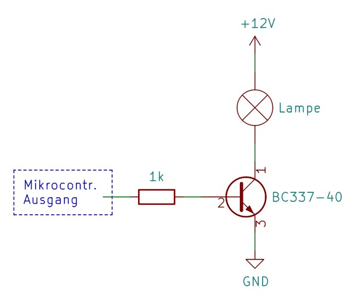

Core SoC: ESP-32-H2

We are not using the Wifi or Zigbee feature for this embedded project.

We use SoC Module: ESP32-H2-WROOM-03.
This chip needs a 3.3V Power Supply delivering 350 mA.

Peripherals:
- Ambient light sensor | VEML7700 | 1x I2C = 2 GPIOs (I2C capable)
- Radar Sensor | LD2410 | 1 GPIO input (floating - no pull-up resistor)  (optionally 2 more Pins for UART rx/tx)
- LED Dimm PWM => 1 GPIO output (PWM capable)
	- Gate Treiber Schaltung NPN-Transistor + MOSFET
- GPIO Switch for 5V Radar Sensor (on/off)
  - 
    - 1k Ohm Resistor
    - NPN Transistor BC337-40  (up to 45V and 200mA)
    - (Radar Sensor: 80 mA average load)

## USB Connection Headers
  - GND, 3.3V, D+,  D-, GPIO9 
  - 5V to 3.3V Logic level converter
  - ESP needs to be set to 'Joint Boot Mode' (GPIO8=1, GPIO9=0)
  - After flash: GPIO 9 high or floating (Default = Pull-Up)

# Notes
- GPIO Pins 15-21 are not recommended to be used  (SPI0, SPI1, reserved for flash)
- GPIO Pins greater than 20 are not yet available in the esp-idf library codebase. 

# LED and Housing
- 5m LED channel Housing
- 5m LED Stripe, 12V (I prefer a warm white (3000-3200K), 8 mm, COB stripe)

# BC337 Biopolar NPN Transistor
- Gate current needs to be limited by a resistor
- When used as switch (what we do here), the gate current should be around 1/10 of the collector current
- It cannot directly switch high workload currents

# IRLB8721PbF N-Channel MOSFET fast, logic level
- should not be switched directly by Logic level PWM because:
  - at 3.3 V Gate voltage the resistance (and gate current) is higher than necessary (>= 4.5 V are good)
  - high PWM frequencies could cause problems (theoretically)
-> so we use a simple gate driver circuit (suitable for PWM Leds use-case)  

# Resources
https://www.electronics-tutorials.ws/de/transistoren/mosfet-als-schalter.html
https://praktische-elektronik.dr-k.de/Bauelemente/Be-BC337.html
