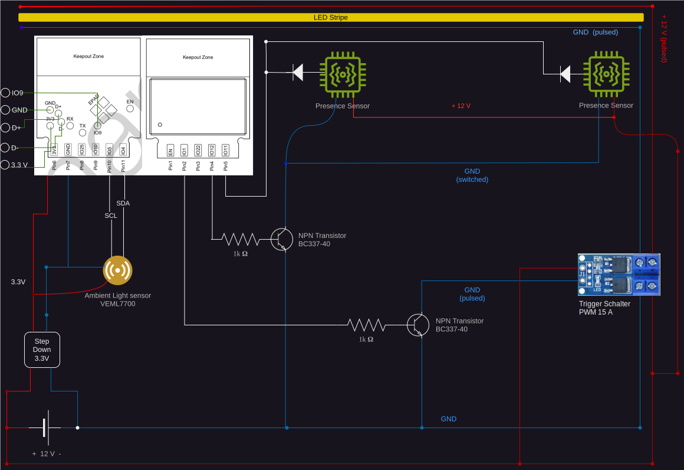

SoC: ESP-32-h2

SoC Module: ESP32-H2-WROOM-03 with 8 GPIOs

Periphals:
- Ambient light sensor | VEML7700 | 1x I2C = 2 GPIOs (I2C capable)
- Radar Sensor | LD2410 | 1 GPIO input (floating - no pull-up resistor)  (optionally 2 more Pins for UART rx/tx)
- LED Dimm PWM => 1 GPIO output (PWM capable)
- GPIO Switch for 5V Radar Sensor (on/off)
  - 
    - 1k Ohm Resistor
    - NPN Transistor BC337-40  (up to 45V and 200mA)
    - (Radar Sensor: 80 mA average load)
=> Using 5 out of 8 available GPIO pins

# Schaltplan 

# TODO
## USB Connection Headers
  - D+ / D- is identified 
  - 5V to 3.3V LDO
  - Joint Boot Mode (GPIO8=1, GPIO9=0)
  - After flash: GPIO 9 high or floating (Default = Pull-Up)

# Notes
GPIO Pins 15-21 are not recommended to be used  (SPI0, SPI1, reserved for flash)

# Resources
https://www.electronics-tutorials.ws/de/transistoren/mosfet-als-schalter.html
https://praktische-elektronik.dr-k.de/Bauelemente/Be-BC337.html
